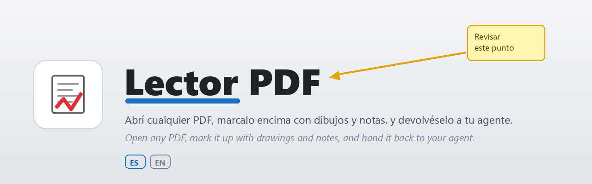
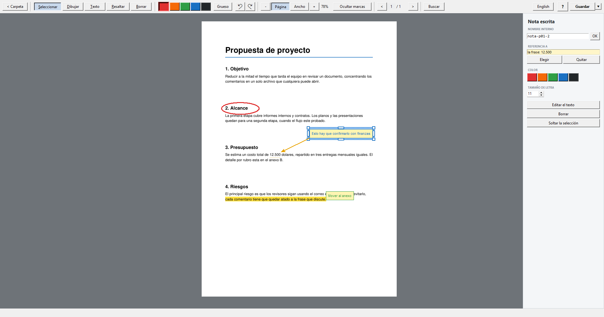
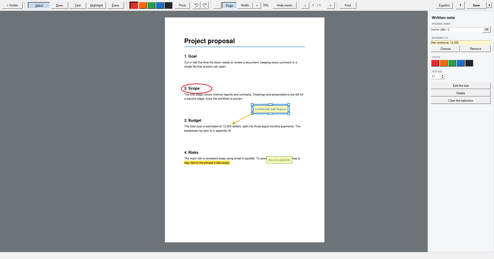

<p align="center">
  
</p>

<p align="center">
  <a href="#-español">🇦🇷 Español</a>&nbsp;&nbsp;·&nbsp;&nbsp;<a href="#-english">🇺🇸 English</a>
</p>

---

## 🇦🇷 Español

**Lector PDF** abre cualquier PDF, te deja marcarlo encima con dibujos y notas, y
lo guarda de forma que un agente conversacional (un asistente de IA) entienda
exactamente qué marcaste y sobre qué parte del texto.

La devolución se explica sola: el PDF guardado trae al principio una **hoja-guía**
que le dice a la IA qué es el archivo y describe cada marca (qué es y sobre qué
texto cae), y cada marca lleva al lado su número. Lo subís a cualquier chat de IA
y listo: no hace falta copiar ningún mensaje aparte.

> 🔒 **Tu PDF original nunca se modifica.** Las marcas se guardan siempre en una
> copia nueva (`documento-devolucion.pdf`), así que podés marcar sin miedo.

<p align="center"></p>

### Qué se puede hacer

- **Dibujar** a mano alzada, **escribir notas** y **resaltar** texto encima del PDF.
- **Atar** una nota o un dibujo a una frase concreta, para que no haya dudas de
  a qué se refiere.
- **Mover, copiar, recolorear, renombrar, unir y borrar** lo marcado. Las notas
  se ajustan solas a su texto; sus manijas cambian el tamaño del recuadro y el
  panel, el tamaño de letra.
- **Ocultar las marcas** un momento para leer el documento limpio.
- **Buscar** texto en el documento y comentar lo encontrado.
- **Guardar** como en cualquier editor: la primera vez elegís el nombre de la
  copia y después `Ctrl+S` guarda encima. **Copiar archivo** deja el PDF listo
  para pegarlo en el chat con `Ctrl+V`.
- La lista de PDFs abre en **la última carpeta que usaste**.
- Interfaz en **español e inglés** (botón *English / Español*).

### Atajos principales

| Acción | Atajo |
|---|---|
| Seleccionar / Dibujar / Texto / Resaltar / Borrar (la letra subrayada del botón) | `S` / `D` / `T` / `R` / `B` |
| Leer (desplazarse) | rueda del mouse |
| Arrastrar la hoja | apretar la ruedita y mover |
| Elegir por área | clic derecho y arrastrar |
| Menú de lo que hay debajo | clic derecho |
| Zoom hacia el mouse | `Ctrl` + rueda |
| Hoja entera / tamaño real / ancho | `Ctrl+0` / `Ctrl+1` / `Ctrl+2` |
| Buscar | `Ctrl+F`, `Enter` o `F3` para el siguiente |
| Deshacer / Rehacer | `Ctrl+Z` / `Ctrl+Y` |
| Copiar / cortar / pegar marcas | `Ctrl+C` / `Ctrl+X` / `Ctrl+V` |
| Elegir todas las marcas | `Ctrl+A` |
| Editar la nota elegida | doble clic o `Enter` |
| Mover lo elegido | flechas (`Shift` para más) |
| Borrar lo elegido | `Supr` |
| Guardar / Guardar como… | `Ctrl+S` / `Ctrl+Shift+S` |
| Abrir otro PDF / volver a la lista | `Ctrl+O` / `Ctrl+W` |
| Ayuda (pasos y atajos) | `F1` |

Pasando el mouse por cualquier botón aparece qué hace y su atajo.

### Instalación

Requiere **Windows** y **Python 3.11** con dos librerías:

```
python -m pip install pymupdf pillow
```

Después, desde una consola de PowerShell **como administrador**, en la carpeta
del proyecto:

```
powershell -ExecutionPolicy Bypass -File instalar.ps1
```

Copia el programa a `C:\Program Files\Mios\LectorPDF` y crea el acceso directo
*Lector PDF* en el escritorio. Si Python está en otro lugar:
`instalar.ps1 -Python "ruta\a\pythonw.exe"`.

### Cómo lee la IA una devolución

Sola, con el PDF: la hoja-guía del principio está escrita como texto común, así
que la lee cualquier IA de chat (y cualquier persona). Dice, por ejemplo, "Marca 3:
raya que cruza por el medio la palabra *Casa* (parece un tachado)" o "Marca 4: nota
atada a la palabra *Negro*". Se arma sola al guardar, con cuentas sobre la posición
de cada marca: no usa ninguna IA ni internet.

Opcional, para un agente que puede ejecutar comandos en tu PC:

```
"ruta\a\python.exe" "C:\Program Files\Mios\LectorPDF\leer_devolucion.py" "archivo-devolucion.pdf"
```

Devuelve el texto original limpio, cada marca con su nombre y la frase sobre la
que cae, y una imagen de cada página marcada (para ver si un trazo es un
círculo, un tachado o una flecha).

### Cómo se guardan las marcas

Como **anotaciones PDF estándar**, no como píxeles pegados a la hoja: por eso se
ven en cualquier otro lector de PDF, el texto del documento sigue intacto y las
marcas se pueden seguir editando después. El PDF original nunca se modifica:
la primera vez se guarda una copia nueva (`-devolucion`, numerada; en inglés
`-feedback`) y después se actualiza esa misma copia. Al reabrirla, el programa
saca la hoja-guía y los números, y los vuelve a hacer al guardar.

### Archivos

| Archivo | Qué es |
|---|---|
| `lector.pyw` | el programa: lista de PDFs, visor y herramientas |
| `anotaciones.py` | guardar y leer las marcas dentro del PDF |
| `guia.py` | la hoja-guía y los números que hacen que la devolución se explique sola |
| `leer_devolucion.py` | el lector de devoluciones que corre el agente |
| `idiomas.py` | todos los textos de la interfaz, en español e inglés |
| `ayuda.py` | la ayuda del botón `?` (F1): pasos y atajos |
| `errores.py` | registro de errores de la sesión |
| `mano.cur` | el cursor de mano para arrastrar la hoja |
| `autotest.py` | pruebas automáticas: `python autotest.py` |
| `instalar.ps1` | instalador |

Nada se escribe junto al programa: el registro de errores, el idioma elegido y
la última carpeta van a `%LOCALAPPDATA%\LectorPDF`.

---

## 🇺🇸 English

**Lector PDF** opens any PDF, lets you mark it up with drawings and notes, and
saves it so that a conversational agent (an AI assistant) understands exactly
what you marked and on which part of the text.

The feedback explains itself: the saved PDF starts with a **guide page** that
tells the AI what the file is and describes each mark (what it is and which text
it falls on), and every mark carries its number next to it. Upload it to any AI
chat and that's it: no separate message to copy.

> 🔒 **Your original PDF is never modified.** Marks are always saved to a new
> copy (`document-feedback.pdf`), so you can mark it up without worry.

<p align="center"></p>

### What you can do

- **Draw** freehand, **write notes** and **highlight** text on top of the PDF.
- **Tie** a note or a drawing to a specific sentence, so there is no doubt
  about what it refers to.
- **Move, copy, recolor, rename, merge and delete** marks. Notes fit their text
  by themselves; their handles change the box size and the panel, the text size.
- **Hide your marks** for a moment to read the clean document.
- **Find** text in the document and comment on what you found.
- **Save** like in any editor: the first time you choose the copy's name, and
  then `Ctrl+S` saves over it. **Copy file** gets the PDF ready to paste in the
  chat with `Ctrl+V`.
- The PDF list opens in **the last folder you used**.
- Interface in **Spanish and English** (*English / Español* button).

### Main shortcuts

| Action | Shortcut |
|---|---|
| Select / Draw / Text / Highlight / Erase (the underlined letter on the button) | `S` / `D` / `T` / `H` / `E` |
| Read (scroll) | mouse wheel |
| Drag the sheet | press the wheel and move |
| Select by area | right-click and drag |
| Menu for what is under the mouse | right-click |
| Zoom toward the mouse | `Ctrl` + wheel |
| Whole page / actual size / width | `Ctrl+0` / `Ctrl+1` / `Ctrl+2` |
| Find | `Ctrl+F`, `Enter` or `F3` for the next one |
| Undo / Redo | `Ctrl+Z` / `Ctrl+Y` |
| Copy / cut / paste marks | `Ctrl+C` / `Ctrl+X` / `Ctrl+V` |
| Select all marks | `Ctrl+A` |
| Edit the selected note | double-click or `Enter` |
| Nudge the selection | arrows (`Shift` for more) |
| Delete the selection | `Del` |
| Save / Save as… | `Ctrl+S` / `Ctrl+Shift+S` |
| Open another PDF / back to the list | `Ctrl+O` / `Ctrl+W` |
| Help (steps and shortcuts) | `F1` |

Hovering over any button shows what it does and its shortcut.

### Installation

Requires **Windows** and **Python 3.11** with two libraries:

```
python -m pip install pymupdf pillow
```

Then, from a PowerShell console **as administrator**, in the project folder:

```
powershell -ExecutionPolicy Bypass -File instalar.ps1
```

It copies the program to `C:\Program Files\Mios\LectorPDF` and creates the
*Lector PDF* shortcut on the desktop. If Python lives elsewhere:
`instalar.ps1 -Python "path\to\pythonw.exe"`.

### How an AI reads a returned file

On its own, from the PDF: the guide page at the start is written as plain text,
so any chat AI (and any person) can read it. It says, for example, "Mark 3: a line
through the middle of the word *Casa* (looks like a strikethrough)" or "Mark 4:
note tied to the word *Negro*". It is built when saving, from the position of
each mark: no AI and no internet involved.

Optional, for an agent that can run commands on your PC:

```
"path\to\python.exe" "C:\Program Files\Mios\LectorPDF\leer_devolucion.py" "file-devolucion.pdf"
```

It returns the clean original text, each mark with its name and the sentence it
falls on, and an image of every marked page (to see whether a stroke is a
circle, a strikethrough or an arrow).

### How marks are stored

As **standard PDF annotations**, not pixels burned onto the page: that is why
they show up in any other PDF reader, the document's text stays intact, and the
marks can still be edited later. The original PDF is never modified: the first
time a new copy is saved (`-feedback`, numbered; `-devolucion` in Spanish), and
after that the same copy is updated. When it is reopened, the program removes
the guide page and the numbers, and rebuilds them when saving.

### Files

| File | What it is |
|---|---|
| `lector.pyw` | the program: PDF list, viewer and tools |
| `anotaciones.py` | saving and reading marks inside the PDF |
| `guia.py` | the guide page and numbers that make the returned file self-explanatory |
| `leer_devolucion.py` | the returned-file reader the agent runs |
| `idiomas.py` | every interface text, in Spanish and English |
| `ayuda.py` | the help behind the `?` button (F1): steps and shortcuts |
| `errores.py` | session error log |
| `mano.cur` | the hand cursor for dragging the sheet |
| `autotest.py` | automated tests: `python autotest.py` |
| `instalar.ps1` | installer |

Nothing is written next to the program: the error log, the chosen language and
the last folder go to `%LOCALAPPDATA%\LectorPDF`.
